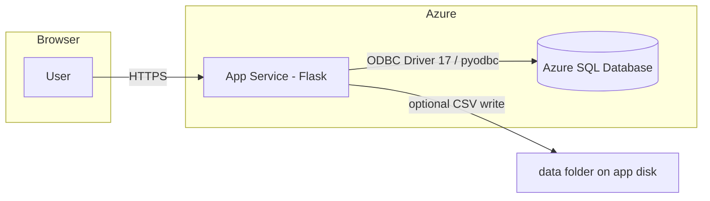

# Smart Retail Personalization

**Course:** CS 5165 — Introduction to Cloud Computing (Spring 2026)  
**Institution:** University of Cincinnati  
**Final Project — Group 46**

---

## Authors

| Name  | Email |
|-------|--------|
| Mark  | [dsilvamj@mail.uc.edu](mailto:dsilvamj@mail.uc.edu) |
| Tejas | [ghodketg@mail.uc.edu](mailto:ghodketg@mail.uc.edu) |

---

## Abstract

**Smart Retail Personalization** is an internet-facing **Flask** web application deployed on **Microsoft Azure App Service**. It connects to **Azure SQL Database** to analyze sample retail data derived from the **84.51° / Kroger “Complete Journey”** style household, transaction, and product extracts. The system supports **user registration and login** (credentials stored in SQL with hashed passwords), **interactive household data pulls** with configurable sorting, **CSV upload** for refreshing local dataset files, a **retail KPI dashboard** with multiple Chart.js visualizations, and a **machine learning insights** area covering **Customer Lifetime Value (CLV)**, **basket / cross-sell analysis** (association rules plus **Gradient Boosting**), and **churn-style recency** analysis with charts. A public **ML overview** page summarizes **Linear Regression**, **Random Forest**, and **Gradient Boosting** and states which technique is used for CLV in this project.

---

## Table of Contents

1. [Features (detailed)](#1-features-detailed)  
2. [System architecture](#2-system-architecture)  
3. [Technology stack](#3-technology-stack)  
4. [Repository layout](#4-repository-layout)  
5. [Prerequisites](#5-prerequisites)  
6. [Local development setup](#6-local-development-setup)  
7. [Environment variables](#7-environment-variables)  
8. [Azure SQL Database](#8-azure-sql-database)  
9. [Loading sample data into Azure SQL](#9-loading-sample-data-into-azure-sql)  
10. [Running the application](#10-running-the-application)  
11. [Azure App Service deployment](#11-azure-app-service-deployment)  
12. [HTTP routes reference](#12-http-routes-reference)  
13. [Course deliverable alignment](#13-course-deliverable-alignment)  
14. [Security and privacy](#14-security-and-privacy)  
15. [Troubleshooting](#15-troubleshooting)  
16. [Known limitations and future work](#16-known-limitations-and-future-work)  
17. [References](#17-references)

---

## 1. Features (detailed)

### 1.1 Home (`/`)

- Project overview and links to main tools.  
- For guests: reminder to **register** or **log in** before using protected analytics.

### 1.2 Registration and authentication

- **`/register`:** Collects **username**, **password**, and **email** (course requirement). Validates length and basic email shape. Inserts a new row into **`AppUsers`** in Azure SQL with a **Werkzeug `pbkdf2:sha256`** password hash (fits typical `NVARCHAR(256)` columns).  
- **`/login`:** Verifies username/password against SQL; establishes a **signed Flask session** (`user_id`, `username`). Supports optional `next` query parameter for redirect after login.  
- **`/logout`:** Clears the session.  
- **Session secret:** Read from **`FLASK_SECRET_KEY`** or **`SECRET_KEY`** in the environment (required in production on Azure).

### 1.3 Sample data pull (`/data-pull`) — authenticated

- Loads up to **100** joined rows per request from **Azure SQL**: `Transactions` joined to `Households` and `Products`.  
- **Search:** User supplies **`hshd_num`** (household number); default sample is **10** when no query is provided.  
- **Sort:** User selects sort field among **hshd_num**, **basket_num**, **date** (purchase date), **product_num**, **department**, **commodity**, and ascending/descending order. Sorting is applied in **pandas** after the SQL query.  
- **Empty results:** Warning message with suggested example household IDs.

### 1.4 Dataset upload (`/upload`) — authenticated

- Accepts three CSV uploads: **`400_households.csv`**, **`400_transactions.csv`**, **`400_products.csv`**, saved under the app’s **`data/`** directory on the server.  
- **Important:** The live **Data Pull**, **Dashboard**, and **ML Insights** pages read from **Azure SQL**, not directly from those CSV files on each request. After uploading new CSVs, operators should run **`load_to_azure_sql.py`** (or an equivalent ETL process) to **reload tables in Azure SQL**, then verify behavior on **Data Pull**.

### 1.5 Retail KPI dashboard (`/dashboard`) — authenticated

- **Summary KPIs:** Total formatted spend; count of unique **baskets**.  
- **Top departments by spend** (bar chart).  
- **Spend over time by `week_num`** (line chart).  
- **Demographics and engagement (course theme):**  
  - Spend by **income range** (from `Households`).  
  - Spend by **children in household** flag.  
  - *(Household size and store region are included in the SQL merge for extension; primary charts focus on income and children.)*  
- **Brand preferences (course theme):**  
  - Spend by **brand type** (`BRAND_TY` on `Products`).  
  - Spend by **natural / organic** product flag (`NATURAL_ORGANIC_FLAG`).  
- Short **business takeaway** text on the page.

### 1.6 Machine learning insights (`/ml-insights`) — authenticated

- **CLV (Customer Lifetime Value):** **Linear Regression** on household-level aggregates (total spend, units, baskets, active weeks, average basket value). Target is a simple **125% of current total spend** proxy for “estimated future CLV,” used to train and predict **predicted CLV**; top households by predicted CLV are tabulated. Model details card on the page.  
- **Basket analysis / cross-selling:**  
  - **Association view:** Top **commodity pairs** appearing in the same basket (frequency).  
  - **ML view (course requirement):** **Gradient Boosting classifier** on basket-level features (line count, distinct commodities, distinct departments) predicting **above-median basket spend**; **feature importances** are shown in a table.  
- **Churn-style analysis:** **Weeks since last purchase** vs dataset max week; **high risk** if gap **≥ 8** weeks. Counts of high vs low risk households, table of sample high-risk households, and a **doughnut chart** for the mix.

### 1.7 ML model write-up (`/ml-overview`) — public

- Concise (**under 200 words** in the main body) description of **Linear Regression**, **Random Forest**, and **Gradient Boosting**, plus explicit statement that **Linear Regression** was selected for **CLV** in this implementation and why.  
- Linked from the main navigation and from **ML Insights**.

---

## 2. System architecture

High-level data flow:



- **Browser** talks to **Azure App Service** over **HTTPS**.  
- **Flask** uses **pyodbc** with **ODBC Driver 17 for SQL Server** to run parameterized SQL against **Azure SQL**.  
- **CSV upload** writes to the app’s **local `data/`** folder; **batch reload** into SQL is done via **`load_to_azure_sql.py`** (typically from a trusted machine with firewall access).

---

## 3. Technology stack

| Layer | Technology |
|--------|------------|
| Language | Python 3.10+ (CI uses 3.10.19) |
| Web framework | Flask 3.x |
| WSGI server (Azure) | Gunicorn (`startup.txt`: `gunicorn app:app`) |
| Data in memory | pandas, NumPy |
| Machine learning | scikit-learn (LinearRegression, GradientBoostingClassifier) |
| Database driver | pyodbc, ODBC Driver 17 for SQL Server |
| Front end | Jinja2 templates, Bootstrap 5.3, Chart.js (CDN), custom CSS |
| Cloud compute | Azure App Service |
| Cloud database | Azure SQL (logical server + database) |
| CI/CD | GitHub Actions (`azure/webapps-deploy`) |

---

## 4. Repository layout

| Path | Purpose |
|------|---------|
| `app.py` | Flask application: routes, SQL helpers, auth, ML logic |
| `requirements.txt` | Pinned / locked Python dependencies for deployment |
| `startup.txt` | Azure App Service startup command (`gunicorn app:app`) |
| `load_to_azure_sql.py` | Offline script: reads CSVs from `data/` and bulk-loads into Azure SQL |
| `templates/` | Jinja HTML: `base.html`, `index.html`, `login.html`, `register.html`, `data_pull.html`, `upload.html`, `dashboard.html`, `ml_insights.html`, `ml_overview.html` |
| `static/` | `style.css`, `script.js` |
| `data/` | Optional local CSVs (gitignored `*.csv`); `.gitkeep` keeps folder in git |
| `.github/workflows/main_smart-retail-app-group46.yml` | Build, zip, deploy to Azure on push to `main` |
| `.gitignore` | Ignores `venv/`, `__pycache__/`, `*.pyc`, `data/*.csv` |

---

## 5. Prerequisites

- **Python 3.10+** (match CI if possible).  
- **Microsoft ODBC Driver 17 for SQL Server** on any machine that runs `app.py` or `load_to_azure_sql.py` with pyodbc.  
- An **Azure SQL** logical server and database with tables **`Households`**, **`Transactions`**, **`Products`** (see loader script for column expectations), plus **`AppUsers`** for authentication.  
- **Azure App Service** (Linux or Windows) with Python runtime and the same ODBC driver available (many Azure Python images include ODBC 17).  
- **Git** and optionally **GitHub** for deployment via Actions.

---

## 6. Local development setup

1. **Clone the repository** (or copy the project folder).  
2. **Create a virtual environment** (recommended):

   ```bash
   python -m venv venv
   ```

   - **Windows (PowerShell):** `.\venv\Scripts\Activate.ps1`  
   - **macOS/Linux:** `source venv/bin/activate`

3. **Install dependencies:**

   ```bash
   pip install --upgrade pip
   pip install -r requirements.txt
   ```

4. **Configure environment variables** (see [Section 7](#7-environment-variables)). For local-only testing without SQL, most routes that hit the database will fail until SQL variables are set.

5. **Run the development server:**

   ```bash
   python app.py
   ```

   Default Flask dev server (see `if __name__ == "__main__": app.run(debug=True)` in `app.py`). Open `http://127.0.0.1:5000`.

---

## 7. Environment variables

Set these in **Azure App Service → Settings → Environment variables** (or locally in your shell / `.env` tooling — do **not** commit secrets).

| Variable | Required | Description |
|----------|----------|-------------|
| `AZURE_SQL_SERVER` | Yes (for DB features) | Full host name, e.g. `yourserver.database.windows.net` (no `https://`). |
| `AZURE_SQL_DATABASE` | Yes | Database name, e.g. `smartretaildb`. |
| `AZURE_SQL_USERNAME` | Yes | SQL login user name. |
| `AZURE_SQL_PASSWORD` | Yes | SQL login password. |
| `FLASK_SECRET_KEY` | **Strongly recommended** | Long random string used to sign session cookies. Alternative name: `SECRET_KEY`. |

After changing variables on Azure, **save** and **restart** the web app.

---

## 8. Azure SQL Database

### 8.1 Tables (retail)

Populated by **`load_to_azure_sql.py`** from the sample CSVs (naming convention `400_*.csv`):

- **`Households`** — household demographics and attributes.  
- **`Transactions`** — line-level purchases (basket, household, product, spend, units, week, year, store region, purchase date, etc.).  
- **`Products`** — product metadata including **department**, **commodity**, **brand type**, **natural/organic** flag.

Join keys used in the app: **`HSHD_NUM`**, **`PRODUCT_NUM`**, **`BASKET_NUM`**, etc. Column names in SQL are typically **uppercase**; the app normalizes some result sets to **lowercase** column names in pandas.

### 8.2 Table `AppUsers` (authentication)

Example DDL used with this project (adjust schema name if needed):

```sql
CREATE TABLE dbo.AppUsers (
    user_id       INT IDENTITY(1,1) PRIMARY KEY,
    username      NVARCHAR(64)  NOT NULL UNIQUE,
    email         NVARCHAR(256) NOT NULL,
    pass_hash     NVARCHAR(256) NOT NULL,
    created_utc   DATETIME2     NOT NULL DEFAULT SYSUTCDATETIME()
);
```

Password hashes are generated with **`pbkdf2:sha256`** (Werkzeug) so they fit a 256-character column.

### 8.3 Networking and firewall

- On the **SQL logical server**, enable appropriate **public network** / **firewall** rules.  
- For App Service in Azure, either enable **“Allow Azure services and resources to access this server”** or add **outbound IP** rules for your App Service.  
- Typical connectivity error: **`TCP Provider: Error code 0x274C (10060)`** — timeout / firewall. Fix networking, confirm server FQDN, restart the web app.

---

## 9. Loading sample data into Azure SQL

1. Obtain the course sample archive (**8451_The_Complete_Journey_2_Sample-2-1.zip** or equivalent) and extract **`400_households.csv`**, **`400_transactions.csv`**, **`400_products.csv`**.  
2. Place them under the project’s **`data/`** directory (or paths configured in `load_to_azure_sql.py`).  
3. Set **`AZURE_SQL_PASSWORD`** (and server/database/user as coded or parameterized) for the loader environment.  
4. Run:

   ```bash
   python load_to_azure_sql.py
   ```

   The script **truncates and repopulates** the retail tables (see script comments and `DELETE` / `INSERT` logic). **Large transaction files** may take several minutes.

5. Confirm rows in **Azure Portal → Query editor** or **SSMS / Azure Data Studio**.

---

## 10. Running the application

### 10.1 Development

```bash
python app.py
```

### 10.2 Production-style (local)

```bash
gunicorn app:app --bind 0.0.0.0:8000
```

Azure uses the command in **`startup.txt`** (`gunicorn app:app`) with platform-specific binding.

---

## 11. Azure App Service deployment

### 11.1 GitHub Actions (this repository)

Workflow file: **`.github/workflows/main_smart-retail-app-group46.yml`**

- **Trigger:** Push to **`main`**.  
- **Steps:** Checkout → setup Python **3.10.19** → `pip install -r requirements.txt` → zip artifact → **`azure/webapps-deploy@v2`** to app name **`smart-retail-app-group46`**.  
- **Secret required in GitHub:** `AZURE_WEBAPP_PUBLISH_PROFILE` — contents of the App Service **publish profile** file from Azure Portal.

### 11.2 App Service configuration checklist

- [ ] Stack: Python version compatible with dependencies.  
- [ ] **Startup command** or **Startup file** aligned with `startup.txt` (`gunicorn app:app`).  
- [ ] All [environment variables](#7-environment-variables) set.  
- [ ] **ODBC Driver 17** available on the worker (default on many Azure Python stacks).  
- [ ] **HTTPS** left enabled (default `*.azurewebsites.net` certificate).  
- [ ] Restart after configuration changes.

### 11.3 Public URL

The deployed app is reachable at the Azure-assigned hostname, for example:

`https://smart-retail-app-group46-<unique>.azurewebsites.net`

(Exact hostname is shown in the Azure Portal for the Web App.)

---

## 12. HTTP routes reference

| Method(s) | Path | Auth | Description |
|-----------|------|------|-------------|
| GET | `/` | No | Home page |
| GET | `/ml-overview` | No | ML models write-up (LR, RF, GB; CLV choice) |
| GET, POST | `/register` | No* | Registration form; redirects if already logged in |
| GET, POST | `/login` | No* | Login form; `next` optional for return URL |
| GET, POST | `/logout` | No | Clears session (typically used when logged in) |
| GET, POST | `/data-pull` | **Yes** | Household SQL pull + sorting |
| GET, POST | `/upload` | **Yes** | CSV upload to server `data/` |
| GET | `/dashboard` | **Yes** | KPI + demographic + brand charts |
| GET | `/ml-insights` | **Yes** | CLV, basket analysis, churn views |

\*Guests use register/login; authenticated users hitting `/register` or `/login` may be redirected to the main app flow.

---

## 13. Course deliverable alignment

This section maps major **CS 5165 final project** requirements to concrete artifacts in the repository.

| Deliverable theme | How it is addressed in this project |
|--------------------|-------------------------------------|
| **Web server on Azure** | Flask app deployed via **Azure App Service**; public HTTPS endpoint. |
| **Interactive pages: username, password, email** | **`/register`** form collects all three; **`/login`** uses username + password; sessions secured with **`FLASK_SECRET_KEY`**. |
| **Azure datastore + sample 84.51-style data** | **Azure SQL** with **`Households`**, **`Transactions`**, **`Products`** loaded via **`load_to_azure_sql.py`**. |
| **Sample data pull for HSHD_NUM #10 + joins + sort fields** | **`/data-pull`** defaults to household **10**; SQL joins three tables; UI sort options match required dimensions. |
| **Interactive search by `hshd_num` + sort** | Same **Data Pull** page with GET form and sort controls. |
| **Upload latest CSVs + verify** | **`/upload`** saves three CSVs; README documents running **`load_to_azure_sql.py`** to refresh SQL before validating on Data Pull. |
| **Dashboard + retail questions** | **`/dashboard`** includes engagement over time, department performance, **demographics (income, children)**, and **brand / organic** splits. |
| **ML write-up (LR, RF, GB) + CLV technique** | **`/ml-overview`** text; **CLV** implemented with **Linear Regression** on **`/ml-insights`**. |
| **ML for basket analysis (LR / RF / GB)** | **Gradient Boosting** basket model + importances; pair-frequency cross-sell table. |
| **Churn prediction + graphics** | Recency rule, counts, table, **doughnut chart** on **`/ml-insights`**. |

---

## 14. Security and privacy

- **Passwords:** Never stored in plain text; only **Werkzeug hashes** in **`AppUsers.pass_hash`**.  
- **Secrets:** Keep **`AZURE_SQL_PASSWORD`**, **`FLASK_SECRET_KEY`**, and publish profiles **out of git**; use Azure and GitHub **secret stores**.  
- **SQL injection:** Household search uses **parameterized** queries (`?` placeholders) for identifiers.  
- **Transport:** Use **HTTPS** in production (default on Azure App Service).  
- **Session cookies:** Signed with the app secret; rotate **`FLASK_SECRET_KEY`** if compromised.

---

## 15. Troubleshooting

| Symptom | Likely cause | What to try |
|---------|----------------|-------------|
| `10060` / `08S01` / TCP timeout to SQL | Firewall / networking | Azure SQL **Networking**: allow Azure services and/or App Service **outbound IPs**; confirm server FQDN; restart web app. |
| `No such file or directory` for CSV on server | CSVs not deployed / not in `data/` | Expected on App Service if only SQL is used; Data Pull should still work if SQL is populated. |
| Login always fails | Wrong password; users table empty; hash mismatch | Register a new user via UI; confirm **`AppUsers`** exists and columns match DDL. |
| Charts empty on dashboard | All-null demographic or brand columns in SQL | Verify **`Households`** / **`Products`** columns populated in Azure. |
| GitHub deploy fails | Missing or invalid publish profile secret | Regenerate publish profile; update **`AZURE_WEBAPP_PUBLISH_PROFILE`** in repo secrets. |

---

## 16. Known limitations and future work

- **Upload vs SQL:** Upload does not automatically stream large CSVs into SQL inside the web request (timeout and memory risk). A dedicated **batch job**, **Azure Data Factory**, or **SqlBulkCopy** pipeline could automate reloads.  
- **CLV target:** The training target is a **simple function of historical spend** (educational proxy), not a full enterprise CLV model with holdout validation.  
- **Churn model:** Rule-based on **weeks since last purchase**; could extend with survival analysis or classifiers using richer features.  
- **Scaling:** Dashboard and ML load a **joined line-level frame** into memory; for multi-GB databases, move aggregations into **SQL** or **incremental** extracts.

---

## 17. References

- **Flask:** [https://flask.palletsprojects.com/](https://flask.palletsprojects.com/)  
- **Azure App Service (Python):** [https://learn.microsoft.com/azure/app-service/quickstart-python](https://learn.microsoft.com/azure/app-service/quickstart-python)  
- **Azure SQL Database:** [https://learn.microsoft.com/azure/azure-sql/](https://learn.microsoft.com/azure/azure-sql/)  
- **ODBC Driver 17 for SQL Server:** [https://learn.microsoft.com/sql/connect/odbc/download-odbc-driver-for-sql-server](https://learn.microsoft.com/sql/connect/odbc/download-odbc-driver-for-sql-server)  
- **scikit-learn:** [https://scikit-learn.org/](https://scikit-learn.org/)  
- **84.51° / Kroger sample context:** Course-provided **8451** sample documentation and data dictionary (see course materials).

---

## Academic integrity and license

This repository was produced **for educational use** in **CS 5165** at the **University of Cincinnati**. Course policies on collaboration, citation, and reuse apply. The application is not a production retail product; metrics and models are **illustrative** unless extended with rigorous validation.

---

**End of README — Group 46 — Smart Retail Personalization**
